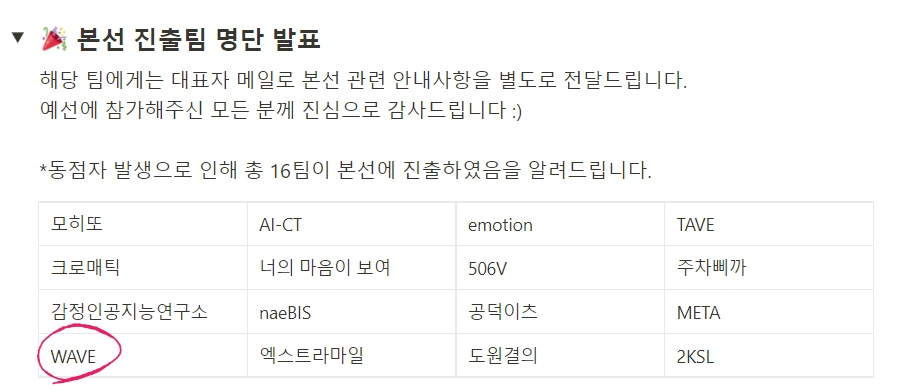

# AI-SPARK-Challenge
제3회 연구개발특구 AI SPARK 챌린지

## 일정
- 참가접수 및 예선: 2022.02.17 ~ 2022.03.17 [✔]
- 서류심사 결과발표 : ~~2022. 03.21~~ 2022. 03.22 [✔]
- 본선 : 2022. 03. 22 ~ 2022. 04. 08.
- 발표평가 : 2022.04.12

## 출연연 데이터 목록

(1) [ETRI AI 나눔] 한국어 음성 감정 데이터셋 (KESDy18): https://nanum.etri.re.kr/share/kjnoh/SER-DB-ETRIv18?lang=ko_KR

(2) [ETRI AI 나눔] 음성 감정인식 데이터셋: https://nanum.etri.re.kr/share/mn99134/speechemotion?lang=ko_KR

## 외부 데이터 목록

(1) [AI-Hub] 비디오 요약 영상: https://aihub.or.kr/aidata/27717

(2) SumMe DataSet: https://gyglim.github.io/me/vsum/index.html#sf_code

(3) TVSum DataSet:http://people.csail.mit.edu/yalesong/tvsum/ 

(4) IEMOCAP: 

(5) RAVDESS: 
  
  
### 참고 

- [ETRI - AI 나눔 데이터 플랫폼](https://nanum.etri.re.kr/share/list?lang=ko_KR)  
- [한국지질자원연구원 - 지오빅데이터 오픈플랫폼(kigam)](https://data.kigam.re.kr/)  
- [한국항공우주연구원 - 위성영상 객체판독 데이터](https://aihub.or.kr/aidata/7982)

### 데이터 사용시 주의 사항
- 위 데이터 중 최소 1개 기관의 데이터를 필수적으로 사용 필요
- 제시된 데이터 중에서는 ‘공개'데이터에 한하여 활용 가능
- 각 플랫폼 내 데이터의 사용가능 범위는 플랫폼 및 데이터별로 상이함
- 각 데이터의 활용범위 및 다운로드 방법은 데이터별 카드 내 상세 활용범위 참고
    - ex) etri 나눔데이터는 데이터 등록자와 ‘협약서 체결'이 필요한 경우가 있음
- 1개 이상의 출연연 데이터를 반드시 활용하되, 기타 데이터 융합은 자유롭게 제안 가능

### 리더보드 제출 방법
[PDF File](./3%ED%9A%8C%20AI%20SPARK%20%EC%B1%8C%EB%A6%B0%EC%A7%80_%ED%83%9C%EC%8A%A4%ED%81%AC%20%EC%83%9D%EC%84%B1%20%EB%A7%A4%EB%89%B4%EC%96%BC.pdf)

## 진행 상황
[To Do List](https://inquisitive-barge-ae2.notion.site/To-Do-List-5059e26c092d4a1b867ed780792408cc)  
[회의록](https://inquisitive-barge-ae2.notion.site/28a4091c8f7d4e02b4d6a4a4be9c21d4)  
[논문 정리](https://inquisitive-barge-ae2.notion.site/6249070da1ac492db830c3089a6d0eb8)  

## More About?
[대회 안내 Notion](https://aifactory.notion.site/3-AI-SPARK-08f0d419637b4536a8949c13af375a10)
